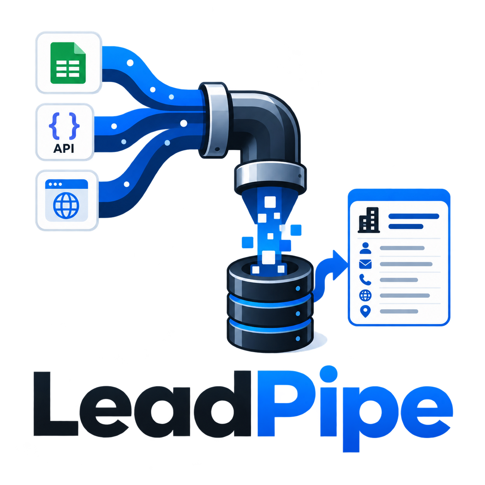
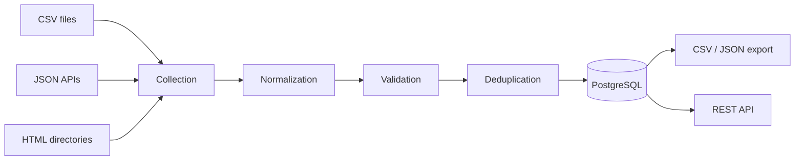
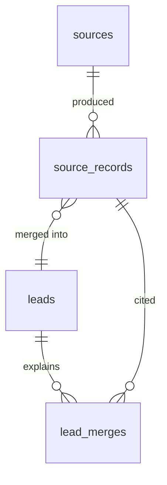

<div align="center">



# LeadPipe

**A configurable Python service for collecting, normalizing, validating and deduplicating
publicly available business leads from multiple sources.**

Built as a reusable automation template for small-business data collection workflows.

[](https://github.com/PeacexF/LeadPipe/actions/workflows/ci.yml)
[](https://www.python.org/)
[](LICENSE)

[Quick start](#quick-start) · [Documentation](#documentation) · [Architecture](docs/architecture.md) · [Deduplication](docs/deduplication.md)

</div>

---

## The problem

A small business wants a list of potential B2B customers. The data exists across several
public directories, but every source spells things differently:

```text
Nordic Clean Oy          NORDIC CLEAN OY              Nordic Clean
www.nordicclean.test     https://nordicclean.test/    nordicclean.test
+358 40 123 4567         040-1234567                  (blank)
Finland                  FI                           Suomi
```

Three rows, one company. Multiply that across a few thousand records and manual cleanup
stops being viable — and a naive `SELECT DISTINCT` merges nothing, because no two rows are
identical.

LeadPipe collects from configured sources, normalizes the values into one schema, validates
what it can, works out which records describe the same company, and keeps a full record of
where every field came from.



---

## What it does

| | |
| --- | --- |
| **Collects** | From configured sources — CSV, JSON API, HTML listings. No source is hardcoded; adding one is a YAML edit |
| **Normalizes** | Company names, emails, URLs, phone numbers (to E.164) and countries (to ISO-3166 alpha-2) |
| **Validates** | Three outcomes — `valid`, `invalid`, `unknown` — so a *missing* email is never confused with a *broken* one. Bad records are flagged and kept, never silently dropped |
| **Deduplicates** | Ordered rules with explicit confidence, merging field by field with a documented precedence. Uncertain matches are flagged for review instead of guessed |
| **Explains itself** | Every collected record is stored immutably; you can always ask which source supplied which field, and which rule merged it |
| **Runs jobs** | A PostgreSQL-backed queue with retries, backoff, heartbeats and stale recovery — safe with several workers, no Redis |
| **Schedules** | Per-source cron, deduplicated so overlapping runs never pile up |
| **Exports** | CSV and JSON, streamed, so table size does not become memory size |
| **Respects limits** | `robots.txt`, per-domain throttling, an identifiable User-Agent, and SSRF guards on every redirect hop |
| **Forgets** | Deletion cascades to raw records and suppresses the contact, so erasure survives the next collection |

---

## Quick start

Requires Docker. Everything below runs against bundled fixtures — no external site is
contacted.

```bash
git clone https://github.com/PeacexF/LeadPipe && cd LeadPipe
cp .env.example .env
docker compose up -d
```

That starts PostgreSQL, applies migrations, and brings up the API, a worker and a local
fixture server. Check it is ready:

```bash
curl localhost:8000/health/ready
```

```json
{"status":"ok","database":true,"migrations_current":true,
 "applied_revision":"0003","expected_revision":"0003","detail":null}
```

### Collect

```bash
for s in example_csv example_api example_directory; do
  curl -s -X POST localhost:8000/api/jobs \
    -H 'Content-Type: application/json' -d "{\"source\":\"$s\"}"
done
```

The API returns `202 Accepted` immediately — collection happens in the worker, never inside
a request. A few seconds later:

```bash
curl -s localhost:8000/api/jobs | jq '.items[] | {source, status, result}'
```

| Source | Collected | Valid | Invalid | Duplicates | New leads | Errors |
| --- | --- | --- | --- | --- | --- | --- |
| `example_csv` | 20 | 17 | 3 | 5 | 15 | 0 |
| `example_api` | 7 | 7 | 0 | 3 | 4 | 1 |
| `example_directory` | 7 | 6 | 1 | 3 | 4 | 1 |

**34 records in, 23 leads out.** The two `errors` are deliberate: a malformed API item, and
a directory page disallowed by `robots.txt`. Neither ends the run.

Run all three again and `new_leads` is `0` — collections are idempotent.

### Export

```bash
curl "localhost:8000/api/export?format=csv" -o leads.csv
curl "localhost:8000/api/export?format=json&city=Helsinki"
```

```json
{
  "id": 1,
  "company_name": "Nordic Clean Oy",
  "contact_name": "Anna Virtanen",
  "website": "https://nordicclean.test",
  "email": "anna.virtanen@nordicclean.test",
  "phone": "+358401234567",
  "address": "Mannerheimintie 12 A",
  "city": "Helsinki",
  "country": "FI",
  "validation_status": "valid",
  "sources": ["example_api", "example_csv", "example_directory"],
  "first_seen_at": "2026-08-10T16:11:33.409695+00:00",
  "last_seen_at": "2026-08-10T16:32:37.193517+00:00"
}
```

Three sources contributed to that one row: the CSV supplied the company under its title-case
spelling, the API the named contact and the precise street, the directory confirmed the
domain.

Interactive API docs are at <http://localhost:8000/docs>.

### Without Docker

```bash
uv sync
docker compose up -d postgres
uv run alembic upgrade head

uv run leadpipe collect -c examples/configs/csv.yaml
```

---

## Seeing deduplication work

The fixtures are deliberately dirty — duplicate companies, mixed capitalization,
inconsistent URLs and phone formats, invalid emails and near-miss names. Ask any lead where
it came from:

```bash
curl -s localhost:8000/api/leads/1 | jq '.provenance'
```

```text
Nordic Clean Oy | anna.virtanen@nordicclean.test | +358401234567 | Helsinki FI

  record  1  example_csv        rule=initial        conf=1.00  review=false
  record  2  example_csv        rule=email          conf=1.00  review=false
  record  8  example_csv        rule=website        conf=0.95  review=false
  record 16  example_csv        rule=name_location  conf=0.80  review=true
  record 21  example_api        rule=website        conf=0.95  review=false
  record 28  example_directory  rule=website        conf=0.95  review=false
```

One company, five records, three sources, two rules. The sixth — record 16, `Nordic Clean
Oyj`, a different company with a very similar name in the same city — was **not** merged. It
became its own lead and the link was kept as a review flag.

### The rules

Applied in order; the first match wins.

| Rule | Confidence | Merges automatically |
| --- | --- | --- |
| Exact email | 1.00 | yes |
| Normalized website domain | 0.95 | yes |
| Phone number (E.164) | 0.90 | yes |
| Company name + location | ≤ 0.80 | **no** — flagged for review |
| Source-specific identifier | 1.00 | yes |

Auto-merge requires 0.85. Name matching is capped at 0.80, so by construction it can never
merge two companies on its own — it uses trigram similarity implemented to match
PostgreSQL's `pg_trgm`, so the SQL candidate lookup and the Python matcher agree on what
"similar" means.

Placeholders cannot create matches: emails need an `@`, phones must be valid E.164, and an
unparseable website yields no domain. Two unrelated companies that both wrote `n/a` are
never merged.

→ [Full rules, thresholds and merge precedence](docs/deduplication.md)

---

## Configuration

Sources are configured, not coded:

```yaml
defaults:
  region: FI

sources:
  - name: example_csv
    type: csv
    priority: 0
    path: ./examples/data/companies.csv
    external_id_field: id
    mapping:
      company_name: name
      email: email
      city: city
      country: country

  - name: partner_directory
    type: html
    priority: 10
    url: ${DIRECTORY_URL}
    item_selector: "li.company"
    detail_link: "a.profile@href"
    requests_per_second: 1
    contact: ops@example.com
    schedule:
      enabled: true
      cron: "30 6 * * 1"
      timezone: Europe/Helsinki
    mapping:
      company_name: ".company-name"
      email: ".email a@href"
```

`priority` decides which source wins when two disagree about a field. `${VAR}` and
`${VAR:-default}` interpolation keeps credentials out of version control. Runtime settings
come from `.env`, which is the single source of truth for the environment.

→ [Every key and environment variable](docs/configuration.md)

---

## Interfaces

### REST API

| Method | Path | Notes |
| --- | --- | --- |
| `GET` | `/health` | Liveness |
| `GET` | `/health/ready` | Database reachable **and** schema current; `503` otherwise |
| `GET` | `/api/leads` | Keyset pagination, filterable |
| `GET` | `/api/leads/{id}` | Includes full provenance |
| `DELETE` | `/api/leads/{id}` | Erases the lead and its records; suppresses by default 🔑 |
| `GET` | `/api/jobs` | Newest first, filter by status and source |
| `GET` | `/api/jobs/{id}` | Includes run statistics |
| `POST` | `/api/jobs` | Enqueues a collection, returns `202` 🔑 |
| `GET` | `/api/sources` | Configured sources |
| `GET` | `/api/suppressions` | Blocked contacts (`POST`/`DELETE` 🔑) |
| `GET` | `/api/export` | `format=csv\|json`, streamed |

🔑 requires `X-API-Key` when `LEADPIPE_API_KEY` is set. Reads stay open. Leads and exports
share the same filters: `source`, `country`, `city`, `validation_status`.

### CLI

| Command | Does |
| --- | --- |
| `leadpipe collect [--source X]` | Run a collection now, in the foreground |
| `leadpipe enqueue X` | Queue one for a worker |
| `leadpipe worker` | Process the queue and run schedules |
| `leadpipe serve` | Run the API |
| `leadpipe export --format csv --out leads.csv` | Export leads |
| `leadpipe sources` | List configured sources and their schedules |
| `leadpipe suppress <value>` / `suppressions` | Manage blocked contacts |
| `leadpipe purge --days 365 [--dry-run]` | Apply the retention policy |

The CLI and the API are thin adapters over the same pipeline — neither owns any logic, and
both read the same configuration.

---

## How it is put together

```text
app/
├── domain/          value types shared across layers
├── normalization/   pure functions: text, email, url, phone, location
├── validation/      per-field tri-state validation
├── deduplication/   fingerprints, match rules, merge policy
├── fetch/           HTTP client, robots.txt, throttling, SSRF guards
├── sources/         source adapters and the type registry
├── pipeline/        the five steps, wired together
├── jobs/            queue, worker, scheduler
├── repositories/    database access
├── exports/         streaming CSV and JSON writers
└── api/             FastAPI application
```

Normalization, validation and deduplication are pure functions with no database and no I/O,
which is why they are the fastest and most thoroughly tested part of the system.

### Storage



| Table | Holds |
| --- | --- |
| `source_records` | One immutable row per source per sighting: the untouched payload, the normalized values, fingerprints, validation |
| `leads` | The merged canonical company, derived from its records |
| `lead_merges` | *Why* each record is attached: rule, confidence, review flag |

Keeping these separate is what makes provenance answerable, merges explainable and re-runs
idempotent — and because the raw payloads are retained, the pipeline can be re-run against
historical data when normalization rules change.

The job queue lives in the same database, claimed with `SELECT ... FOR UPDATE SKIP LOCKED`.
For a service that already requires PostgreSQL, a second broker would buy throughput this
workload does not need.

→ [Architecture in full](docs/architecture.md) · [Running it](docs/operations.md)

---

## Collecting responsibly

The constraints in this domain are mostly legal, so they are part of the design rather than
a disclaimer:

- `robots.txt` is fetched, cached and obeyed; `Crawl-delay` is honoured
- requests are throttled per domain and the client identifies itself
- private, loopback and link-local addresses are refused unless explicitly allowed
- contact data is redacted from every log line
- deleting a lead erases its raw records and suppresses the contact, so it cannot return
- `RETENTION_DAYS` and `leadpipe purge` implement storage limitation

There is deliberately no support for bypassing logins, defeating anti-bot measures or
rotating identities. Absent by design, not unimplemented.

→ [Lawful basis, erasure and the operator checklist](docs/legal.md)

---

## Documentation

| Document | Read it for |
| --- | --- |
| [Architecture](docs/architecture.md) | The pipeline, the storage model, why the queue is in PostgreSQL |
| [Deduplication](docs/deduplication.md) | Fingerprints, the five rules, thresholds, merge precedence |
| [Configuration](docs/configuration.md) | Every YAML key, adapter option and environment variable |
| [Operations](docs/operations.md) | Workers, retries, health checks, logging, retention |
| [Adding a source](docs/adding-a-source.md) | The `Source` protocol, with a worked adapter |
| [Legal](docs/legal.md) | Lawful basis, robots posture, erasure, what is never collected |
| [Limitations](docs/limitations.md) | Known gaps, honestly |
| [Examples](examples/README.md) | What every fixture row is designed to trigger |

The API reference is generated, not hand-written: <http://localhost:8000/docs>.

---

## Development

```bash
make check       # lint, typecheck, test
make test
make format
```

Integration tests start a throwaway PostgreSQL container automatically, or use
`TEST_DATABASE_URL` to point at your own. Migrations run against that container on every
test run, so the schema is verified rather than assumed. The suite never touches the
network.

---

## Limitations

- Website matching uses the hostname, not the registrable domain, so `shop.example.com` and
  `example.com` are different companies
- Company-name matching never merges on its own, and there is no UI for reviewing the pairs
  it flags
- The queue is single-database: correct for several workers, not a distributed workflow
  platform
- Email validation is syntax only — no MX lookup, and no mailbox probing by design
- Every collection is a full run; there is no incremental mode

→ [The complete list](docs/limitations.md)

---

## License

[MIT](LICENSE)
