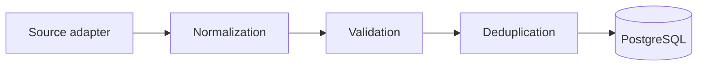
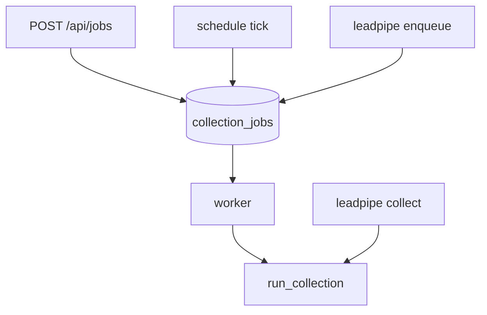
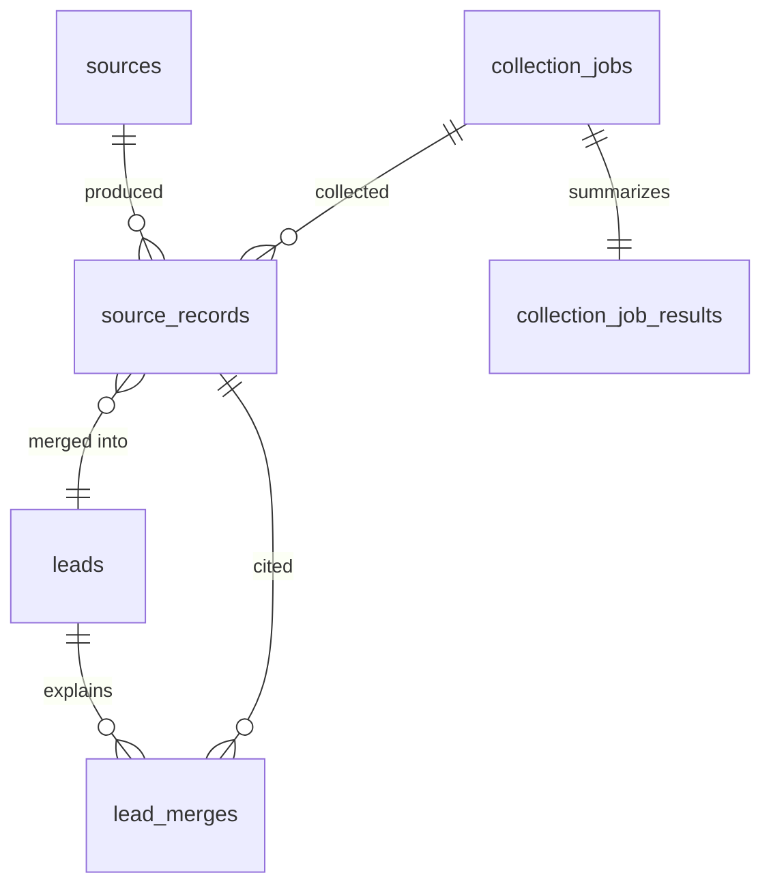

# Architecture

LeadPipe turns messy records from several public sources into one clean lead per company,
without losing track of where anything came from.

## The pipeline

Every collection runs the same five steps. The first four are pure functions with no
database and no I/O; only the last one touches storage.



| Step | Input | Output | Where |
| --- | --- | --- | --- |
| Collect | source config | `RawRecord` per item | `app/sources/` |
| Normalize | `RawRecord` | `NormalizedLead` | `app/normalization/` |
| Validate | `NormalizedLead` | `LeadValidation` | `app/validation/` |
| Deduplicate | `NormalizedLead` + stored leads | `MatchResult`, `MergedLead` | `app/deduplication/` |
| Persist | all of the above | rows | `app/repositories/` |

The pure core is why the test suite runs without a network and why the rules can be
reasoned about in isolation. `app/pipeline/runner.py` is the only place that knows about
all five steps at once.

## How a collection is triggered

Three entry points, one pipeline:



The API never runs a collection inside a request — it enqueues one and returns `202
Accepted`. `leadpipe collect` bypasses the queue and runs the pipeline in the foreground,
which is useful for development and for one-off runs.

## Storage model

Three tables carry the interesting part of the design.



| Table | Holds | Mutability |
| --- | --- | --- |
| `sources` | one row per configured source | upserted from config each run |
| `source_records` | one row per source per company sighting: raw payload, normalized values, fingerprints, validation | rewritten in place on re-collection, never merged |
| `leads` | the merged canonical company | derived, rebuilt from its records |
| `lead_merges` | why a record is attached to a lead: rule, confidence, review flag | append-only |
| `collection_jobs` | queue rows and their lifecycle | see [operations](operations.md) |
| `collection_job_results` | per-run counters | one row per job |
| `suppressions` | contacts that must never be collected again | see [legal](legal.md) |

### Why the split

A single `leads` table with a `source` column cannot answer "which source gave us this
phone number" once two sources disagree. Keeping the collected record separate from the
merged company means:

- **Provenance is answerable.** `GET /api/leads/{id}` lists every contributing record with
  the rule and confidence that attached it.
- **Merges are explainable and reversible.** `lead_merges` is a log of decisions, not an
  outcome; a wrong merge can be traced to the rule that made it.
- **Re-runs are idempotent.** A record is keyed per source, so collecting the same page
  twice updates one row instead of creating a second company.
- **Rules can change.** The untouched payload is retained in `source_records.raw`, so the
  pipeline can be re-run against historical data when normalization improves.

### Record identity

`record_key` is the source's own identifier when the config names one
(`external_id_field`), and otherwise a SHA-256 of the normalized lead with the collection
timestamp removed. Together with `source_id` it is unique. That is what makes a second
collection of an unchanged directory produce zero new leads:

```text
job 1  example_csv  collected=20  new=15  duplicates=5
job 4  example_csv  collected=20  new=0   duplicates=20
```

## Why the queue lives in PostgreSQL

Jobs are claimed with `SELECT ... FOR UPDATE SKIP LOCKED`, which gives at-most-one-worker
delivery without a second piece of infrastructure. For a service that already requires
PostgreSQL, adding Redis or RabbitMQ would buy throughput this workload does not need and
cost an extra component to deploy, monitor and back up. Job state, run counters and the
data they produced also stay in one transaction boundary.

The trade-off is deliberate and has limits — see [limitations](limitations.md).

## Module map

```text
app/
├── domain/          value types shared across layers
├── normalization/   pure functions: text, email, url, phone, location
├── validation/      per-field tri-state validation
├── deduplication/   fingerprints, match rules, merge policy
├── fetch/           HTTP client, robots.txt, throttling, SSRF guards
├── sources/         source adapters and the type registry
├── pipeline/        the five steps, wired together
├── jobs/            queue, worker, scheduler
├── repositories/    database access
├── exports/         streaming CSV and JSON writers
├── db/              models, session, readiness
├── api/             FastAPI application
└── cli.py           Typer commands
```

Dependencies point inwards: `api` and `cli` are thin adapters over `pipeline`, and nothing
in `normalization`, `validation` or `deduplication` imports a database module.

## Further reading

- [Deduplication](deduplication.md) — the rules, thresholds and merge precedence
- [Configuration](configuration.md) — every YAML key and environment variable
- [Operations](operations.md) — running it, retries, health, logging
- [Adding a source](adding-a-source.md) — the `Source` protocol
