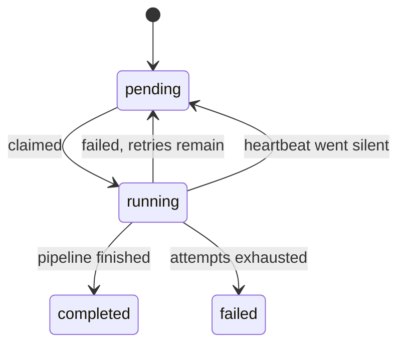

# Operations

Running LeadPipe, and what it does when things go wrong.

## Processes

| Process | Command | Responsibility |
| --- | --- | --- |
| API | `leadpipe serve` | Reads, enqueues jobs, streams exports. Never collects. |
| Worker | `leadpipe worker` | Claims jobs, runs collections, fires schedules. |
| Migrations | `alembic upgrade head` | Runs to completion before either starts. |

With Docker Compose all three are wired together, and `api` and `worker` wait for
`migrate` to exit successfully:

```bash
docker compose up -d
docker compose logs -f worker
```

Locally:

```bash
docker compose up -d postgres
uv run alembic upgrade head
uv run leadpipe serve      # terminal 1
uv run leadpipe worker     # terminal 2
```

`leadpipe collect` runs the pipeline in the foreground without the queue. Convenient for
development; not how you run it in production.

## The job queue

Jobs live in `collection_jobs`. A worker claims one with `SELECT ... FOR UPDATE SKIP
LOCKED`, so several workers can run against the same database without coordinating and
without processing the same job twice.



| Behaviour | Default | Setting |
| --- | --- | --- |
| Attempts per job | 3 | `max_attempts` column |
| Retry backoff | 5s, doubling, capped at 300s, with jitter | `app/jobs/queue.py` |
| Heartbeat | every 10s while running | `WorkerConfig.heartbeat_interval` |
| Considered stale after | 60s of silence | `WorkerConfig.stale_after` |
| Stale sweep | every 30s | `WorkerConfig.recover_every` |
| Idle poll | 1s | `--poll-interval` |

A worker that is killed mid-job stops heartbeating; the next sweep by any worker returns
the job to `pending`, or marks it `failed` if its attempts are exhausted. Backoff is
jittered so retries from several workers do not synchronise.

Failures are recorded on the job, not swallowed:

```bash
curl "http://localhost:8000/api/jobs?status=failed"
```

A single bad record never fails a run — it is counted in `errors` and logged with its
reason. Only an unusable source (missing file, unreachable endpoint, bad configuration)
fails the job.

## Scheduling

Every worker runs the scheduler unless started with `--no-scheduler`. Ticks do not race:
each one enqueues only if that source has no pending or running job, using row locking, so
five workers ticking at the same second produce one job.

```bash
uv run leadpipe worker --no-scheduler    # pure queue consumer
uv run leadpipe worker --once            # process one job, exit
```

Cron semantics are documented in [configuration](configuration.md#scheduling).

## Health

| Endpoint | Meaning | Use for |
| --- | --- | --- |
| `GET /health` | The process is up | liveness probe |
| `GET /health/ready` | Database answers **and** the schema is at the expected revision | readiness probe, deploy gate |

```json
{
  "status": "ok",
  "database": true,
  "migrations_current": true,
  "applied_revision": "0003",
  "expected_revision": "0003",
  "detail": null
}
```

`/health/ready` returns `503` when the database is unreachable or a migration is pending,
which is exactly when an instance should be kept out of a load balancer. It degrades rather
than raising: an unreadable migrations directory reports "not ready", it does not crash the
endpoint.

## Migrations

```bash
uv run alembic upgrade head
uv run alembic downgrade -1
uv run alembic current
```

Every migration is applied to a real PostgreSQL container during the test run, so the
schema is verified rather than assumed. Deploy order is migrate, then start; Compose
enforces it.

## Logging

Structured logs via structlog. `LOG_FORMAT=console` is readable during development,
`LOG_FORMAT=json` is one JSON object per line for shipping.

```json
{"event": "collection completed", "job": 1, "source": "example_csv",
 "collected": 20, "valid": 17, "new_leads": 15, "level": "info"}
```

- Every HTTP request logs method, path, status and `duration_ms`.
- Each request gets a `request_id`, echoed back as `X-Request-ID`; send your own to trace a
  call end to end.
- Job and source names are bound to every log line emitted during a collection, so one run
  can be filtered out of a busy log.
- Credentials (`password`, `token`, `api_key`, `authorization`, `x-api-key`) **and**
  collected contact data (`email`, `phone`, `address`, `contact_name`, `website`) are
  replaced with `[redacted]` before anything is written. Logs are the easiest place to leak
  personal data by accident, and the hardest place to delete it from later.

## Security

Reads are open; writes require `X-API-Key` when `LEADPIPE_API_KEY` is set.

| Endpoint | Requires key |
| --- | --- |
| `POST /api/jobs` | yes |
| `DELETE /api/leads/{id}` | yes |
| `POST /api/suppressions`, `DELETE /api/suppressions/{id}` | yes |
| everything else | no |

Leaving `LEADPIPE_API_KEY` unset disables the check entirely — acceptable on a private
network, not on a public one. CORS is off until `CORS_ORIGINS` lists an origin.

Outbound requests are guarded: URLs resolving to private, loopback or link-local addresses
are refused unless the source explicitly sets `allow_private_hosts`, and every redirect hop
is re-checked. Responses larger than the configured limit are rejected rather than
truncated.

The container runs as a non-root user and ships without the build toolchain.

## Retention and erasure

```bash
uv run leadpipe purge --days 365 --dry-run   # count without deleting
uv run leadpipe purge --days 365
```

Keyed on `last_seen_at`, so a lead that keeps appearing in collections is never purged by
age. `RETENTION_DAYS` supplies the default; without either, the command refuses rather than
guessing.

Deleting a lead removes its source records and merge history, and by default suppresses its
email and domain so re-collection cannot bring it back. See [legal](legal.md).

## Backups

Everything is in PostgreSQL — leads, records, jobs and suppressions. A standard `pg_dump`
of the one database is a complete backup; there is no second datastore to keep consistent
with it.
